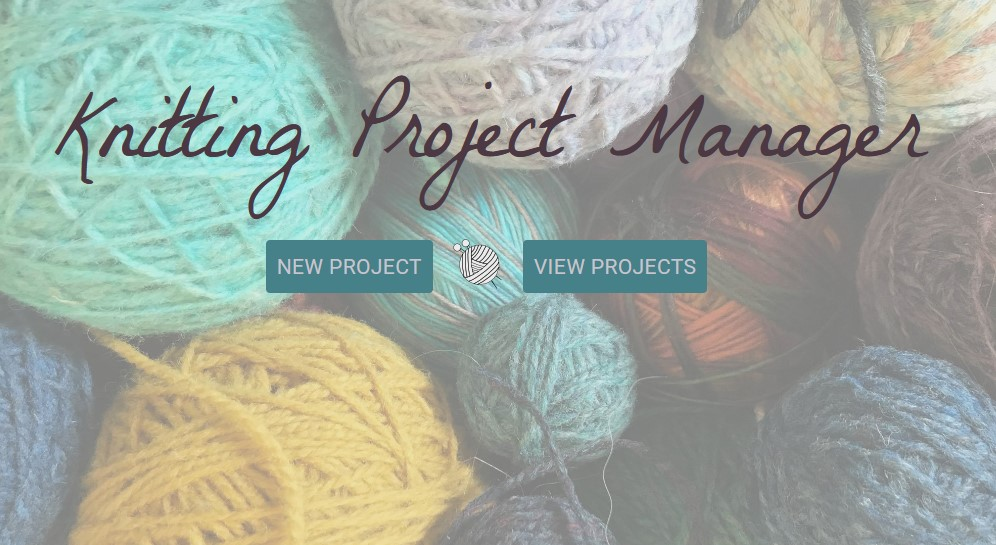

# Knitting Project Manager

## Description

I am currently working on this project so it may not work as expected. \
This app allows you to create new knitting patterns for projects. You can choose a grid size to represent the pattern you want to repeat. Then you will selected the colours you are using for the project. Next you will fill in the grid with your desired pattern. You will also be able to save patterns and look back at them.

## Motivation

As someone who enjoys knitting I thought this would be a fun way to learn react, and I would end up with a useful app at the end!

## Built With

-React\
-MUI\
-React Router\
-React Hook Form\
-Yup\
-React Color

## Link to Demo Site

https://isabelmcilroy.github.io/KnittingProjectManager/

## Screenshot

